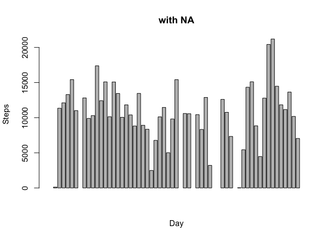
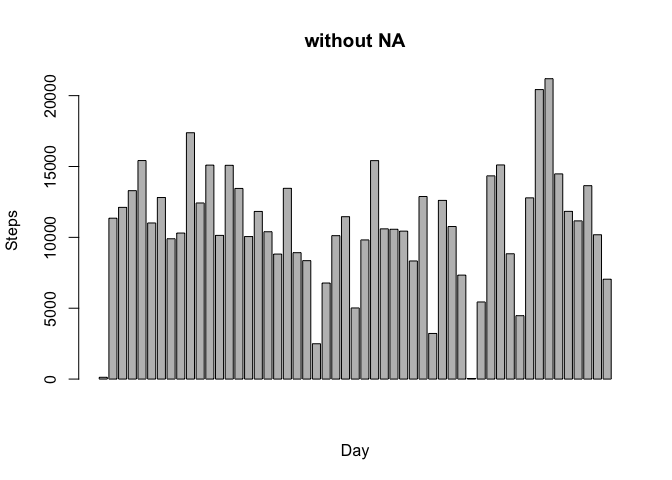
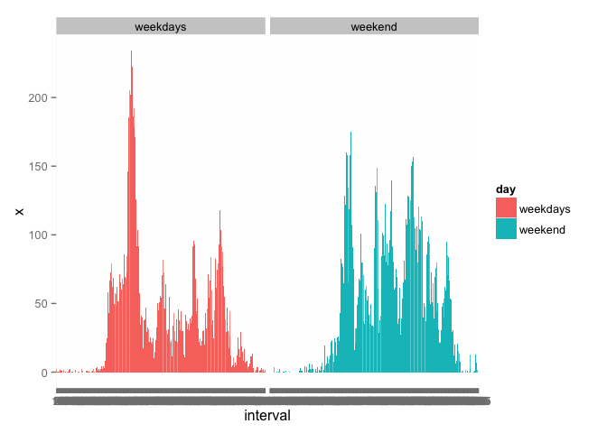

# Reproducible Research: Peer Assessment 1
Luigi Pistis  
14 maggio 2015  


## Loading and preprocessing the data

```r
#As first step let's import data
activity <- read.csv("~/Downloads/activity.csv")

#I also remove NA
activitynoNA<-activity[!is.na(activity[,1]),]
```

## What is mean total number of steps taken per day?


```r
#aggregate the number of step by day 
agg<-aggregate(activity$steps,by = list(day=activity$date), FUN=sum)
aggnoNA<-aggregate(activitynoNA$steps,by = list(day=activitynoNA$date), FUN=sum)

#plot
barplot(agg$x,xlab="Day",ylab="Steps",main="with NA")
```

 

```r
barplot(aggnoNA$x,xlab="Day",ylab="Steps",main="without NA")
```

 


## What is the average daily activity pattern?

```r
#aggregate the number of step by interval 
#to calculate the average I have to use na.rm=TRUE or to use the dataset without NA,otherwise the calculation returns NA, so the following 2 tables are the same

agg1<-aggregate(activity$steps,by = list(interval=activity$interval), FUN=mean,na.rm=TRUE)
agg1noNA<-aggregate(activitynoNA$steps,by = list(interval=activitynoNA$interval), FUN=mean)

#check if they are equal
all.equal(agg1,agg1noNA)
```

```
## [1] TRUE
```

```r
#plot 
plot(agg1$x,xlab="interval",ylab="Steps",type="l")
```

 


## Imputing missing values

```r
#first i duplicate the dataframe with all data
activityfillNA<-activity

#then I replace all NA with the average of the correspondent inverval (the averarage where calculated on the previous step and saved on agg1)
for(i in 1:nrow(activityfillNA))
   if(is.na(activityfillNA[i,1]))
       activityfillNA[i,1]<-agg1[agg1$interval==activityfillNA[i,3],"x"]
```


## Are there differences in activity patterns between weekdays and weekends?

```r
#create a new columw with "weekend/weekdays"
for(i in 1:nrow(activity)){
    if(weekdays(as.Date(activity[i,2]))=="Domenica"|weekdays(as.Date(activity[i,2]))=="Sabato")
        {
            activity$day[i]<-"weekend"
        }
    
    else{        
        activity$day[i]<-"weekdays"
        }
}
aggf<-aggregate(activity$steps,by = list(interval=activity$interval,day=activity$day), FUN=mean,na.rm=TRUE)


library(ggplot2)
ggplot(aggf,aes(fill=day,y=x,x=as.factor(interval)))+geom_bar(stat="identity")+facet_grid(. ~ day)+xlab("interval")
```

```
## Warning: position_stack requires constant width: output may be incorrect
```

```
## Warning: position_stack requires constant width: output may be incorrect
```

 
